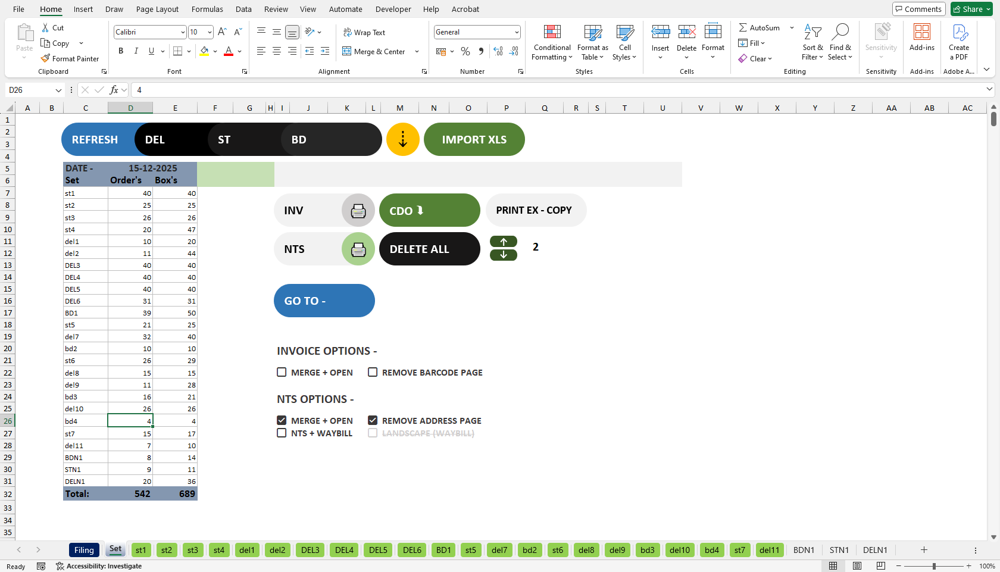

# Excel-Driven Automation Pipeline (VBA ➜ BAT ➜ Python ➜ Outlook/PDF)

## 📌 Overview
This project implements a **multi-layer automation pipeline** where **Excel VBA acts as the control panel**, triggering backend automation through **Batch scripts and Python** to process **Outlook emails and PDF documents**.

The system is designed for **business and logistics workflows** that rely heavily on Excel while requiring powerful automation capabilities behind the scenes.

Users interact only with Excel buttons and dropdowns — no command-line usage is required.

---

## 🧠 Architecture & Flow

- Excel (VBA UI & Controls)

- Batch Files (.bat)

- Python Scripts

- Outlook / PDF / File System

- Results & Status back to Excel

---

## 🚀 Key Features
- Excel-based UI for non-technical users
- VBA-driven workflow orchestration
- Batch files for Windows execution control
- Python backend for heavy processing
- Outlook email automation (PDF attachments)
- PDF extraction, splitting, merging, and validation
- Excel-based progress and status feedback
- Modular and extensible design

---

## 🧩 Role of Each Layer

### 📊 Excel VBA
- Acts as the main **control panel**
- Handles user input, validation, and navigation
- Triggers batch files via buttons
- Displays live progress and results
- Manages printing and formatting

---

### ⚙️ Batch Files (.bat)
- Bridge between Excel and Python
- Launch Python scripts reliably on Windows
- Support silent execution
- Allow simple double-click execution

---

### 🐍 Python
- Core automation engine
- Processes PDFs (extract, split, merge, validate)
- Automates Outlook email attachment downloads
- Performs file system operations
- Writes results back to Excel

---

### 📧 Outlook / 📄 PDF Processing
- Downloads PDF attachments from emails
- Extracts structured data from PDFs
- Handles bulk document workflows
- Supports high-volume operations

---

## ▶️ How to Run (User Workflow)

1. Open the Excel macro-enabled file
2. Select options in the **Set** sheet
3. Click the required action button
4. VBA triggers the corresponding batch file
5. Batch file runs Python automation
6. Results and status are updated in Excel

---

## ▶️ How to Run (Developer)

### Install Python dependencies
```bash
pip install -r requirements.txt
```
---

## 🐍 Python Environment (Optional)

It is recommended to use a Python virtual environment to isolate dependencies:

```bash
python -m venv venv
venv\Scripts\activate
```

---

## 📊 Excel Control Panel (Sample)

Below is a sample view of the Excel control panel used to trigger and monitor the automation workflow.



> ⚠️ The actual working Excel file is not included for security reasons.  
> This image represents a sanitized sample layout showing buttons and controls.

---

## ⚠️ Requirements
- Windows operating system
- Microsoft Excel (macros enabled)
- Microsoft Outlook (configured account)
- Python 3.8+
- PDFs must contain selectable text (not scanned)

---

## 📈 Use Case

- Business document automation
- Logistics and operations workflows
- Email-based PDF processing
- Excel-driven automation systems
- Reducing manual document handling